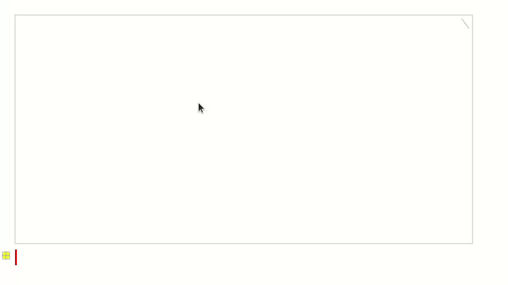
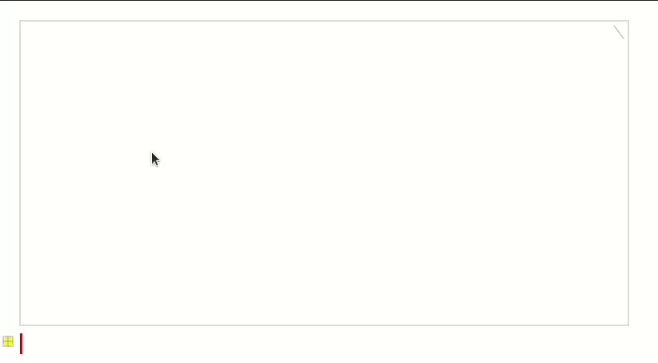

# Plain text with lines

An editor for plain text where you can also seamlessly insert line drawings.
Designed above all to be easy to modify and give you early warning if your
modifications break something.

http://akkartik.name/lines.html

This fork experiments with number-based keyboard shortcuts within drawings:

  * `ctrl+2` for lines,
  * `ctrl+3` for triangles,
  * `ctrl+4` for squares,
  * etc.

Also corresponding shortcuts without `ctrl+` in the middle of a stroke.

Here are two videos showing the difference. Drawing squares upstream using
`s`:



Drawing squares in this fork using `4`:



Be careful switching to this fork from the upstream version and _vice versa_.
Polygons created with one won't be read with the other. Best make a backup as
well before such experiments.

## Getting started

Install [LÖVE](https://love2d.org). It's just a 5MB download, open-source and
extremely well-behaved. I'll assume below that you can invoke it using the
`love` command, but that might vary depending on your OS.

To run from the terminal, [pass this directory to LÖVE](https://love2d.org/wiki/Getting_Started#Running_Games),
optionally with a file path to edit.

Alternatively, turn it into a .love file you can double-click on:
```
$ zip -r /tmp/lines.love *.lua
```

By default, lines.love reads/writes the file `lines.txt` in
[a directory relative to this app](https://love2d.org/wiki/love.filesystem.getSourceBaseDirectory).

To open a different file, drop it on the lines.love window.

## Keyboard shortcuts

While editing text:
* `ctrl+f` to find patterns within a file
* `ctrl+c` to copy, `ctrl+x` to cut, `ctrl+v` to paste
* `ctrl+z` to undo, `ctrl+y` to redo
* `ctrl+=` to zoom in, `ctrl+-` to zoom out, `ctrl+0` to reset zoom
* `alt+right`/`alt+left` to jump to the next/previous word, respectively
* mouse drag or `shift` + movement to select text, `ctrl+a` to select all
* `ctrl+e` to modify the sources

For shortcuts while editing drawings, consult the online help. Either:
* hover on a drawing and hit `ctrl+h`, or
* click on a drawing to start a stroke and then press and hold `h` to see your
  options at any point during a stroke.

lines.love has been exclusively tested so far with a US keyboard layout. If
you use a different layout, please let me know if things worked, or if you
found anything amiss: http://akkartik.name/contact

## Known issues

* No support yet for Unicode graphemes spanning multiple codepoints.

* No support yet for right-to-left languages.

* Undo/redo may be sluggish in large files. Large files may grow sluggish in
  other ways. lines.love works well in all circumstances with files under
  50KB.

* If you kill the process, say by force-quitting because things things get
  sluggish, you can lose data.

* The text cursor will always stay on the screen. This can have some strange
  implications:

    * A long series of drawings will get silently skipped when you hit
      page-down, until a line of text can be showed on screen.
    * If there's no line of text at the top of the file, you may not be able
      to scroll back up to the top with page-up.

  So far this app isn't really designed for drawing-heavy files. For now I'm
  targeting mostly-text files with a few drawings mixed in.

* No clipping yet for drawings. In particular, circles/squares/rectangles and
  point labels can overflow a drawing.

* If you ever see a crash when clicking on the mouse, it might be because a
  mouse press and release need to happen in separate frames. Try pressing and
  releasing more slowly and let me know if that helps or not. This is klunky,
  sorry.

* Touchpads can drag the mouse pointer using a light touch or a heavy click.
  On Linux, drags using the light touch get interrupted when a key is pressed.
  You'll have to press down to drag.

* Can't scroll while selecting text with mouse.

* No scrollbars yet. That stuff is hard.

## Mirrors and Forks

This repo is a fork of [lines.love](http://akkartik.name/lines.html), an
editor for plain text where you can also seamlessly insert line drawings.
Updates to it can be downloaded from:

* https://git.sr.ht/~akkartik/lines-polygon-experiment
* https://tildegit.org/akkartik/lines-polygon-experiment
* https://git.merveilles.town/akkartik/lines-polygon-experiment
* https://github.com/akkartik/lines-polygon-experiment
* https://nest.pijul.com/akkartik/lines-polygon-experiment (using the Pijul version control system)

Further forks are encouraged. If you show me your fork, I'll link to it here.

## Feedback

[Most appreciated.](http://akkartik.name/contact) Messages, PRs, patches,
forks, it's all good.
